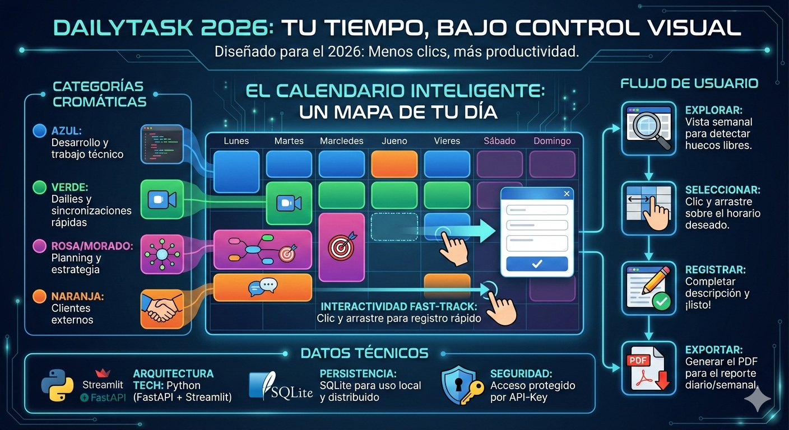

# DailyTask 2026 📌



Aplicación completa para el control de tareas diarias diseñada para el año 2026.

## 🚀 Arquitectura
- **Backend**: FastAPI + SQLAlchemy (SQLite) + FPDF2 (PDF).
- **Frontend**: Streamlit + Streamlit-Calendar (FullCalendar 6).
- **Seguridad**: Autenticación por `X-API-KEY`.

## 🌟 Características Principales
- **Vista de Calendario Interactiva**: Gestión visual de tareas por día, semana y mes.
- **Registro Rápido**: Selección de rangos horarios directamente en el calendario para auto-completar el registro.
- **Doble Sistema de Replicación**:
    - **Por Día**: Duplica todas las tareas de un día origen a uno destino desde la barra lateral.
    - **Replicación Rápida**: Copia una tarea específica a una o varias fechas destino directamente desde el detalle en el calendario.
- **Gestión Dinámica de Categorías**: Tabla independiente de categorías con nombres y colores personalizados gestionables desde la aplicación.
- **Reportes Profesionales**: Generación de reportes PDF filtrados por fecha con nombres de categorías dinámicos.
- **Importación Inteligente**: Procesamiento masivo de tareas desde archivos de texto.

## 🛠️ Instalación y Mantenimiento

1. Instalar dependencias:
   ```bash
   pip install -r backend/requirements.txt
   pip install -r frontend/requirements.txt
   ```

2. Inicializar base de datos y categorías:
   ```bash
   $env:PYTHONPATH="backend"
   python backend/scripts/seed_categories.py
   ```

3. Ejecutar Backend:
   ```bash
   cd backend
   uvicorn app.main:app --reload
   ```

4. Ejecutar Frontend:
   ```bash
   cd frontend
   streamlit run app.py
   ```

## 🧪 Pruebas Unitarias
Se ha implementado una suite de pruebas para asegurar la estabilidad:
```bash
$env:PYTHONPATH="backend"
pytest backend/tests/
```

## 📂 Estructura de Scripts
- `backend/scripts/seed_categories.py`: Inicializa las categorías básicas y sus colores.
- `backend/scripts/migrate_task_categories.py`: Enlaza tareas antiguas con el nuevo sistema relacional de categorías.
- `backend/scripts/manual_migration.py`: Script de utilidad para cambios estructurales en SQLite.

## 🐳 Docker
Para levantar todo el entorno:
```bash
docker-compose up --build
```

## 📄 Formato de Importación TXT
Crea un archivo `.txt` con el siguiente formato (uno por línea):
`Fecha;Descripción;Hora Inicio;Hora Fin;Categoría (Opcional);Etiquetas;Estado`

Ejemplo:
`2026-01-08;Reunión de desarrollo;09:00;10:30;Reunion Desarrollo;técnico,daily;completada`

> **Tip**: Puedes descargar una plantilla de ejemplo directamente desde la barra lateral de la aplicación.

## 🔒 API Externa
Puedes insertar tareas desde aplicaciones como **n8n** enviando un POST a `/tasks/` con el header `X-API-KEY`.
